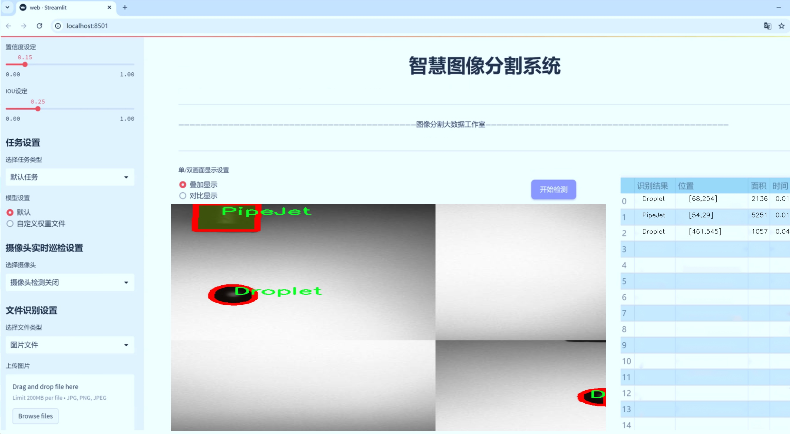
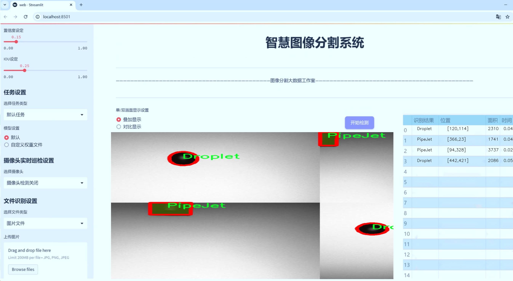
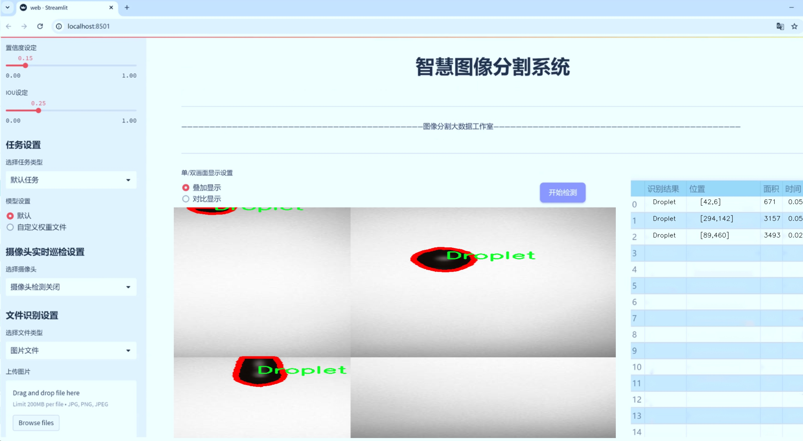
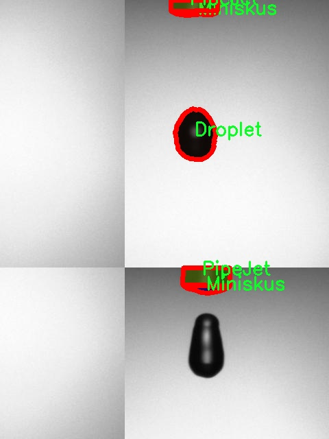
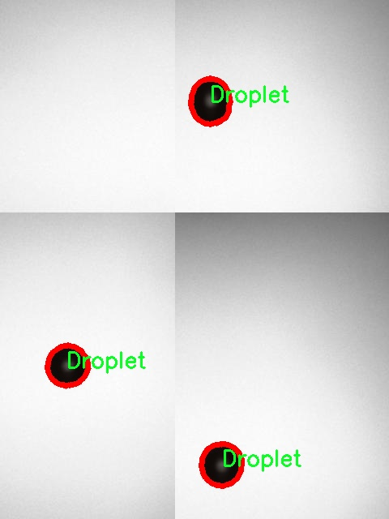
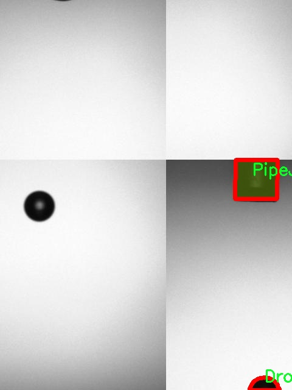
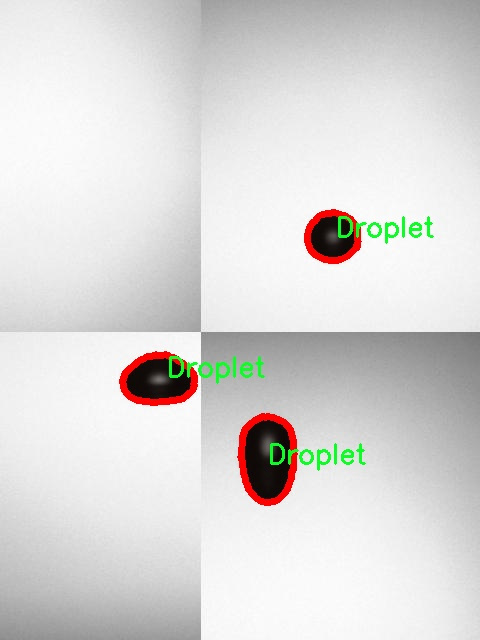
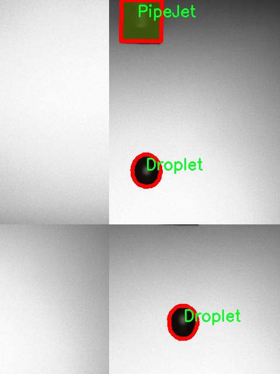

# 液滴图像分割系统源码＆数据集分享
 [yolov8-seg-ContextGuidedDown＆yolov8-seg-C2f-OREPA等50+全套改进创新点发刊_一键训练教程_Web前端展示]

### 1.研究背景与意义

项目参考[ILSVRC ImageNet Large Scale Visual Recognition Challenge](https://gitee.com/YOLOv8_YOLOv11_Segmentation_Studio/projects)

项目来源[AAAI Global Al lnnovation Contest](https://kdocs.cn/l/cszuIiCKVNis)

研究背景与意义

在现代科学研究和工业应用中，液滴的形态、分布及其动态行为的分析具有重要的意义。液滴不仅在化学反应、材料科学和生物医学等领域中扮演着关键角色，而且在喷雾技术、雾化过程以及微流体系统的设计与优化中也至关重要。随着计算机视觉技术的迅猛发展，基于深度学习的图像分割方法逐渐成为液滴分析的主要工具之一。尤其是YOLO（You Only Look Once）系列模型，以其高效的实时检测能力和较高的准确性，广泛应用于各种图像处理任务中。然而，传统YOLO模型在处理复杂液滴图像时，仍面临着分割精度不足和对多类别液滴的识别能力有限等挑战。

本研究旨在基于改进的YOLOv8模型，构建一个高效的液滴图像分割系统，以实现对不同类型液滴的精准识别与分割。所使用的数据集包含2000幅图像，涵盖了五类液滴：Dropiskus、Droplet、Miniskus、PipeJet和Satellit。这些类别的多样性为模型的训练提供了丰富的样本，有助于提高模型在实际应用中的泛化能力。通过对这些液滴的有效分割，研究将为液滴行为的定量分析提供基础数据，进而推动相关领域的研究进展。

在液滴图像分割的过程中，YOLOv8模型的改进将集中在增强特征提取能力和优化分割精度上。具体而言，采用多尺度特征融合技术，以更好地捕捉液滴在不同尺寸和形态下的特征。同时，引入注意力机制，以提高模型对液滴边缘和细节的敏感性，从而提升分割效果。这些改进不仅能够提高模型的性能，还能为液滴的动态分析提供更为准确的图像数据支持。

此外，液滴图像分割系统的研究具有广泛的应用前景。在化学工程中，液滴的分布和相互作用直接影响反应速率和产物质量；在生物医学领域，液滴的精确分割有助于细胞分析和药物输送系统的优化；在环境监测中，液滴的识别与追踪可以用于水质检测和污染物分析。因此，基于改进YOLOv8的液滴图像分割系统不仅具有理论研究的价值，更具备重要的实际应用意义。

综上所述，本研究通过改进YOLOv8模型，构建高效的液滴图像分割系统，旨在解决当前液滴图像分析中的关键问题，推动液滴研究的深入发展。通过对液滴的精准分割与识别，将为相关领域的研究提供强有力的数据支持，促进科学技术的进步与应用创新。

### 2.图片演示







##### 注意：由于此博客编辑较早，上面“2.图片演示”和“3.视频演示”展示的系统图片或者视频可能为老版本，新版本在老版本的基础上升级如下：（实际效果以升级的新版本为准）

  （1）适配了YOLOV8的“目标检测”模型和“实例分割”模型，通过加载相应的权重（.pt）文件即可自适应加载模型。

  （2）支持“图片识别”、“视频识别”、“摄像头实时识别”三种识别模式。

  （3）支持“图片识别”、“视频识别”、“摄像头实时识别”三种识别结果保存导出，解决手动导出（容易卡顿出现爆内存）存在的问题，识别完自动保存结果并导出到tempDir中。

  （4）支持Web前端系统中的标题、背景图等自定义修改，后面提供修改教程。

  另外本项目提供训练的数据集和训练教程,暂不提供权重文件（best.pt）,需要您按照教程进行训练后实现图片演示和Web前端界面演示的效果。

### 3.视频演示

[3.1 视频演示](https://www.bilibili.com/video/BV1Pty8YGEuH/)

### 4.数据集信息展示

##### 4.1 本项目数据集详细数据（类别数＆类别名）

nc: 5
names: ['Dropiskus', 'Droplet', 'Miniskus', 'PipeJet', 'Satellit']


##### 4.2 本项目数据集信息介绍

数据集信息展示

在本研究中，我们采用了名为“bin-sasha-niklas-emre”的数据集，以支持改进YOLOv8-seg的液滴图像分割系统的训练与评估。该数据集的设计旨在提供多样化的液滴图像样本，涵盖了多种液滴形态和特征，进而为深度学习模型的训练提供丰富的标注数据。数据集的类别数量为五个，具体类别包括：Dropiskus、Droplet、Miniskus、PipeJet和Satellit。这些类别不仅反映了液滴的不同形态和特征，还为模型的多样性和鲁棒性提供了良好的基础。

首先，Dropiskus类别代表了一种特定形状的液滴，通常呈现出较为独特的轮廓和流动特性。该类别的图像样本展示了液滴在不同环境条件下的变化，涵盖了从静态到动态的多种状态。这为模型学习如何识别和分割这种特定液滴形态提供了丰富的实例，增强了模型在实际应用中的适应能力。

Droplet类别则是液滴图像分割的核心，包含了各种常见液滴的图像。该类别的样本不仅数量庞大，而且多样性极高，涵盖了不同大小、形状和背景的液滴。这种多样性使得模型能够学习到液滴的基本特征，从而在复杂场景中更好地进行分割。

Miniskus类别则专注于微小液滴的图像，这些液滴通常在实验室或工业应用中出现。由于其尺寸较小，分割这类液滴的难度较大，因此该类别的样本为模型提供了挑战性，促使其在精度和细节处理上不断提升。

PipeJet类别则模拟了液滴在管道流动中的状态，强调了液滴在流体动力学环境下的行为。通过这一类别的样本，模型能够学习到液滴在高速流动中的形态变化及其与周围流体的相互作用，为实际应用中的液滴监测和控制提供了重要的参考。

最后，Satellit类别则涵盖了与液滴相关的卫星图像或间接观测数据，展示了液滴在更大尺度上的分布和行为。这一类别的样本为模型提供了更广泛的视角，帮助其理解液滴在不同环境和条件下的表现。

通过对“bin-sasha-niklas-emre”数据集的深入分析与利用，我们期望能够有效提升YOLOv8-seg在液滴图像分割任务中的性能。该数据集不仅为模型提供了丰富的训练样本，还通过多样化的类别设置，增强了模型的泛化能力和适应性。随着研究的深入，我们相信这一数据集将为液滴图像分割领域的进一步发展提供重要的支持和推动力。











### 5.全套项目环境部署视频教程（零基础手把手教学）

[5.1 环境部署教程链接（零基础手把手教学）](https://www.bilibili.com/video/BV1jG4Ve4E9t/?vd_source=bc9aec86d164b67a7004b996143742dc)


[5.2 安装Python虚拟环境创建和依赖库安装视频教程链接（零基础手把手教学）](https://www.bilibili.com/video/BV1nA4VeYEze/?vd_source=bc9aec86d164b67a7004b996143742dc)

### 6.手把手YOLOV8-seg训练视频教程（零基础小白有手就能学会）

[6.1 手把手YOLOV8-seg训练视频教程（零基础小白有手就能学会）](https://www.bilibili.com/video/BV1cA4VeYETe/?vd_source=bc9aec86d164b67a7004b996143742dc)


按照上面的训练视频教程链接加载项目提供的数据集，运行train.py即可开始训练



     Epoch   gpu_mem       box       obj       cls    labels  img_size
     1/200     0G   0.01576   0.01955  0.007536        22      1280: 100%|██████████| 849/849 [14:42<00:00,  1.04s/it]
               Class     Images     Labels          P          R     mAP@.5 mAP@.5:.95: 100%|██████████| 213/213 [01:14<00:00,  2.87it/s]
                 all       3395      17314      0.994      0.957      0.0957      0.0843

     Epoch   gpu_mem       box       obj       cls    labels  img_size
     2/200     0G   0.01578   0.01923  0.007006        22      1280: 100%|██████████| 849/849 [14:44<00:00,  1.04s/it]
               Class     Images     Labels          P          R     mAP@.5 mAP@.5:.95: 100%|██████████| 213/213 [01:12<00:00,  2.95it/s]
                 all       3395      17314      0.996      0.956      0.0957      0.0845

     Epoch   gpu_mem       box       obj       cls    labels  img_size
     3/200     0G   0.01561    0.0191  0.006895        27      1280: 100%|██████████| 849/849 [10:56<00:00,  1.29it/s]
               Class     Images     Labels          P          R     mAP@.5 mAP@.5:.95: 100%|███████   | 187/213 [00:52<00:00,  4.04it/s]
                 all       3395      17314      0.996      0.957      0.0957      0.0845


### 7.50+种全套YOLOV8-seg创新点代码加载调参视频教程（一键加载写好的改进模型的配置文件）

[7.1 50+种全套YOLOV8-seg创新点代码加载调参视频教程（一键加载写好的改进模型的配置文件）](https://www.bilibili.com/video/BV1Hw4VePEXv/?vd_source=bc9aec86d164b67a7004b996143742dc)

### 8.YOLOV8-seg图像分割算法原理

原始YOLOV8-seg算法原理

YOLOv8-seg算法是YOLO系列中的最新版本，发布于2023年1月10日。作为计算机视觉领域的一项重要进展，YOLOv8不仅在目标检测方面表现卓越，还扩展了实例分割的能力，使其在多种应用场景中展现出极高的实用性和灵活性。YOLOv8-seg在YOLOv5的基础上进行了全面的优化和改进，借鉴了YOLOv6、YOLOX等模型的设计理念，致力于在精度和执行速度上超越现有的所有模型。

YOLOv8-seg的核心在于其独特的网络结构，该结构由三个主要部分组成：Backbone、Neck和Head。Backbone部分负责特征提取，采用了一系列卷积和反卷积层，结合残差连接和瓶颈结构，旨在减小网络规模的同时提升性能。与之前的YOLO版本不同，YOLOv8引入了C2f模块，这一模块通过增加跳层连接和Split操作，增强了特征流动性，使得网络在处理复杂图像时能够更好地捕捉细节信息。

在Backbone中，YOLOv8使用了5个CBS模块和4个C2f模块，并引入了快速空间金字塔池化（SPPF）模块。SPPF模块通过不同内核尺寸的池化操作，对特征图进行合并，进一步提升了特征的表达能力。这种设计不仅保留了YOLOv5的轻量级特性，还使得YOLOv8在处理高分辨率图像时，能够有效提取多尺度的特征信息，从而增强了对小目标的检测能力。

Neck部分则采用了多尺度特征融合技术，通过结合来自Backbone不同阶段的特征图，YOLOv8能够更好地捕捉不同尺度目标的信息。这一部分的设计采用了“双塔结构”，结合了特征金字塔和路径聚合网络（PAN），促进了语义特征与定位特征的有效转移。这种特征融合策略不仅提高了目标检测的性能，还增强了模型的鲁棒性，使其在复杂环境下依然能够保持较高的检测精度。

Head部分是YOLOv8-seg的关键所在，负责最终的目标检测和分类任务。与之前的YOLO版本相比，YOLOv8-seg在Head部分进行了显著的改进，采用了解耦头的结构，将回归分支和分类分支进行分离。这一创新设计不仅加速了模型的收敛速度，还提升了检测的准确性。YOLOv8-seg的检测头设有三个不同尺寸的检测器，能够在不同的尺度下进行目标信息的检测，进一步提升了对复杂场景的适应能力。

YOLOv8-seg还引入了新的损失函数，这一损失函数的设计旨在优化模型的训练过程，使得模型在各种硬件平台上都能高效运行。无论是在CPU还是GPU上，YOLOv8-seg都能够实现快速的推理速度和高精度的检测结果，这使得它在实时目标检测和实例分割任务中具备了强大的竞争力。

此外，YOLOv8-seg在小目标检测和高分辨率图像处理方面的能力也得到了显著提升。通过对模型结构的优化，YOLOv8-seg能够在处理小目标时，保持较高的检测精度。这一特性对于许多实际应用场景，如自动驾驶、安防监控等，具有重要的意义。

总的来说，YOLOv8-seg算法通过一系列创新设计，提升了目标检测和实例分割的性能。其在Backbone、Neck和Head部分的改进，使得YOLOv8-seg在处理复杂图像时，能够更好地捕捉细节信息，并有效融合多尺度特征。这些优势使得YOLOv8-seg成为计算机视觉领域中一款极具潜力的模型，能够广泛应用于各类实际场景中，推动了目标检测和实例分割技术的发展。随着YOLOv8-seg的不断优化和应用推广，未来在智能监控、自动驾驶、医疗影像分析等领域，其应用前景将更加广阔。


### 9.系统功能展示（检测对象为举例，实际内容以本项目数据集为准）

图9.1.系统支持检测结果表格显示

  图9.2.系统支持置信度和IOU阈值手动调节

  图9.3.系统支持自定义加载权重文件best.pt(需要你通过步骤5中训练获得)

  图9.4.系统支持摄像头实时识别

  图9.5.系统支持图片识别

  图9.6.系统支持视频识别

  图9.7.系统支持识别结果文件自动保存

  图9.8.系统支持Excel导出检测结果数据


### 10.50+种全套YOLOV8-seg创新点原理讲解（非科班也可以轻松写刊发刊，V11版本正在科研待更新）

#### 10.1 由于篇幅限制，每个创新点的具体原理讲解就不一一展开，具体见下列网址中的创新点对应子项目的技术原理博客网址【Blog】：


[10.1 50+种全套YOLOV8-seg创新点原理讲解链接](https://gitee.com/qunmasj/good)

#### 10.2 部分改进模块原理讲解(完整的改进原理见上图和技术博客链接)【如果此小节的图加载失败可以通过CSDN或者Github搜索该博客的标题访问原始博客，原始博客图片显示正常】
### YOLOv8简介
在各种目标检测算法中，YOLO系列因其速度和准确度间的优异平衡脱颖而出，能够准确、快速的识别目标，便于部署到各种移动设备中，已经广泛应用于各种领域的目标检测、跟踪和分割。目前最新版本 YOLOv8由原v5的开发团队Ultralytics于2023年1月提出，按规格大小可划分为n、s、m、1和x5个版本，是目前最先进的目标检测算法，有着优异的性能，很适合用于无人机航拍图像目标检测。其网络结构如图所示。

YOLOv8模型包括Input、Backbone、Neck 和Head4部分。其中 Input选用了Mosaic数据增强方法，并且对于不同大小的模型，有部分超参数会进行修改，典型的如大模型会开启 MixUp 和CopyPaste数据增强，能够丰富数据集，提升模型的泛化能力和鲁棒性。Backbone主要用于提取图片中的信息，提供给Neck和Head使用，由多个Conv、C2f模块和尾部的SPPF组成。Conv模块由单个Conv2d、
BatchNorm2d和激活函数构成,用丁是双行在万E5特征图;YOLOv8参考了C3模块的残左绒以心YOLOv7[16l的ELAN思想，设计出了C2f 结构，可以在保证轻量化的同时获得更加丰富的梯度流信息，并根据模型尺度来调整通道数，大幅提升了模型性能;SPPF是空间金字塔池化，能够融合不同尺度的特征。Neck部分主要起特征融合的作用，充分利用了骨干网络提取的特征，采用FPN[17]+PAN[18〕结构，
能够增强多个尺度上的语义表达和定位能力。Head输出端根据前两部分处理得到的特征来获取检测目标的类别和位置信息，做出识别,换以小旦公来和定解耦头结构,将分类和检测头分:9w‘无锅框的位关注侧重点不同的问题，同时也采用了无锚框的目标检测（Anchor-Free)，能够提升检测速度。Loss计算方面采用了正负样本动态分配策略，使用 VFLLoss 作为分类损失，使用DFLLoss+CIOU Loss作为回归损失。

### AutoFocus: Efficient Multi-Scale Conv简介

参考该博客提出了AutoFocus，一种高效的多尺度目标检测算法。相较于以前对整个图像金字塔进行处理，该方法以一种由表及里的姿态，仅处理哪些整体上看来很有可能存在小物体的区域。这个可以通过预测一张类别未知的分割图FocusPixels来得到。为了高效利用FocusPixels，另外一个算法用于产生包含FocusPixels的FocusChips，这样可以减少计算量并处理更更精细的尺度。在不同尺度上FocusChips所得到的检测结果综合时，会出现问题，我们也提供了解决问题的方案。AutoFocus在COCO上的结果有49.7%mAP（50%重叠下68.3%），与多尺度baseline相仿但是快了2.5倍。金字塔中处理的像素数量减少了5倍mAP只下降1%，在与RetinaNet采用相同的ResNet-101结构且速度相同时，高了10%mAP。

人类寻找物体是一个动态的过程，且寻找时间与场景的复杂度是直接相关的。当我们的眼神在不同的点之间漂移时，其他的区域会被我们有意忽视。然而，现在的检测算法是一种静态的推理过程且图像金字塔中的每个像素都受到了一样的对待，这使得过程变得没有效率。现在许多的应用都不强调实时性，而计算上的节省其实可以产生很大收益。

在COCO数据集中，虽然40%的物体都是小物体，但是它们一共只占了全图的0.3%。如果金字塔是3倍关系，则在高分辨率层要进行9倍的运算。XXX 。那么有没有办法在低分辨率下找出可能含有这些物体的区域呢？

以人眼方案类比，我们可以从低分辨率图像开始，找出有可能存在物体的区域再“聚集”到高分辨率。我们的AutoFocus会在一层中计算小物体的分割图FocusPixels，而在每一个FocusPixels上会用一个算法产生下一层所需要关注的chips。在COCO的最大分辨率层上我们可以只处理**20%的像素而性能不下降，如果只处理5%**也只下降1%而已。


图像金字塔与卷积神经网络对CV十分重要。然而卷积神经网络无法做到对尺度不敏感，所以为了不同大小的物体需要依赖图像金字塔。虽然训练已经有了高效的方法，但是其推断时间依然远离实际使用标准。

目标检测加速有很长历史了。常用的有特征近似以减少尺度、级联、特征金字塔，且最后一个最近很多人研究。

AutoFocus为速度与精度之间提供了一个平滑的折衷，指出可以在低分辨率下看出小物体的所在，从而节约计算。FocusPixels的计算较为容易。

先简单介绍一下SNIP，是一种多尺度的训练、推断算法。主要思想是训练针对某个特定scale的检测器而不是scale-invariant检测器。这样训练样本就局限于在某个尺度范围内，以适于这个检测器处理。比如在高分辨率仅处理小物体而高分辨率仅处理大物体，其优势在于训练时不用考虑尺度的变化。

由于训练时物体大小是已知的，我们在图像金字塔中可以忽略大量区域而只处理物体周围的区域。SNIPER说明这样低分辨率的训练与全图训练相比并不会降低性能。同样，在推断过程中如果可以在大分辨率图像上预测可能出现小物体的chip，我们也就不用处理整张高分辨率图片。在训练时，许多物体会被裁剪、扭曲，这可以当作是一种数据扩增，然而当这个情况在推断时出现，则会产生错误，所以我们还需要一个算法来整合不同尺度上的检测结果。

#### AutoFocus框架
如SIFT、SURF等传统分类特征包含两个组件，一个detector和一个descriptor。detector只包含轻量级的操作如DoG、LoG，用于在整张图片上找到感兴趣的区域；descriptor，一般来说计算量比较大，则只需要关注那些咸兴趣的区域。这个级联结构保障了图片处理的效率。

同样，AutoFocus框架也是用于预测感兴趣的区域，并丢弃在下一尺度不可能存在物体的区域，并将裁剪和缩放后的区域传递给下一尺度。AutoFocus由三个部分组成：FocusPixels，FocusChips和focus stacking。

#### FocusPixels
FocusPixels定义在卷积网络特征图的粒度之上（如conv5），如果特征图上某个像素与小物体有重叠则标注为一个FocusPixel。（小物体：面积处于一个网络的输入范围之内）。训练过程中，FocusPixels标注为正，某些与不在面积范围内的物体有重叠的像素标注为无效，其他像素标注为负。AutoFocus的训练目标是使在FocusPixels区域产生较大的激活值。

如果同时多个物体与同一像素重叠，优先给正标注。我们的网络输入是512x512，然后a,b,c取值分别是5,64,90。对于太大或太小的物体，我们认为当前尺度上没有足够人信息进行判断，所以会标定为无效。整个网络结构如下图。训练时加两层带ReLU的卷积(3x3和1x1)以及一个二分类softmax来预测FocusPixels。


#### FocusChip生成
推断过程中，我们标注输出概率大于阈值t的像素（这个参数可以控制加速比），得到一些连通域。对于每一个域，我们做一次膨胀使其包含一些有助于识别的周围信息，膨胀后相连的部分要合并。然后，我们生成一些包含连通域的chips（不同chips可能重叠，如有重叠则合并）。有些chip可能太小缺少必要信息，并使chip的大小变化很大，为了效率我们要求保证一个最小的chip size。算法流程如下：


#### 级联推断过程
我们的过程类似于图片金字塔的推断过程但是在过程中一步步去除不关注的图片区域。我们在最低分辨率上进行检测并生成chips，然后在这些chips再进行检测和生成chips。

#### Focus Stacking
这种级联分类器的一个问题是在chip边缘本来的大物体可能生成一些被剪裁的检测目标。在下一个尺度上，由于剪裁过了，所以会检测到小的、错误的正例False Positive。之前算法中的第二步膨胀其实就是为了保证没有物体会出现在chip的边缘。这样，当我们在局部图片chip的边缘检测到物体时，就可以把这个检测结果丢弃，即使其在SNIP的范围内。

也有一些物体在图片边缘的特殊情况。如果chip和图片共享一条边的话，我们会检查检测结果的其他边是否完全在里面，如果在，则保留它，否则丢弃。

在每一尺度得到有效检测结果后，我们可以将不同尺度上的结果进行整合，将这些结果映射到原图坐标系上。最后，非极大值抑制NMS用于聚集。网络结构如之前的图片所示。


### 11.项目核心源码讲解（再也不用担心看不懂代码逻辑）

#### 11.1 ultralytics\models\rtdetr\model.py

以下是对代码的核心部分进行分析和详细注释的结果：

```python
# Ultralytics YOLO 🚀, AGPL-3.0 license
"""
RT-DETR接口，基于视觉变换器的实时目标检测器。RT-DETR提供实时性能和高准确性，
在CUDA和TensorRT等加速后端上表现出色。它具有高效的混合编码器和IoU感知查询选择，
以提高检测准确性。

有关RT-DETR的更多信息，请访问：https://arxiv.org/pdf/2304.08069.pdf
"""

# 导入必要的模块和类
from ultralytics.engine.model import Model  # 导入基础模型类
from ultralytics.nn.tasks import RTDETRDetectionModel  # 导入RT-DETR检测模型类

# 导入预测、训练和验证相关的类
from .predict import RTDETRPredictor
from .train import RTDETRTrainer
from .val import RTDETRValidator


class RTDETR(Model):
    """
    RT-DETR模型接口。该基于视觉变换器的目标检测器提供实时性能和高准确性。
    支持高效的混合编码、IoU感知查询选择和可调的推理速度。

    属性:
        model (str): 预训练模型的路径。默认为'rtdetr-l.pt'。
    """

    def __init__(self, model='rtdetr-l.pt') -> None:
        """
        使用给定的预训练模型文件初始化RT-DETR模型。支持.pt和.yaml格式。

        参数:
            model (str): 预训练模型的路径。默认为'rtdetr-l.pt'。

        异常:
            NotImplementedError: 如果模型文件扩展名不是'pt'、'yaml'或'yml'。
        """
        # 检查模型文件的扩展名是否有效
        if model and model.split('.')[-1] not in ('pt', 'yaml', 'yml'):
            raise NotImplementedError('RT-DETR仅支持从*.pt、*.yaml或*.yml文件创建。')
        # 调用父类的初始化方法
        super().__init__(model=model, task='detect')

    @property
    def task_map(self) -> dict:
        """
        返回RT-DETR的任务映射，将任务与相应的Ultralytics类关联。

        返回:
            dict: 一个字典，将任务名称映射到RT-DETR模型的Ultralytics任务类。
        """
        return {
            'detect': {
                'predictor': RTDETRPredictor,  # 预测器类
                'validator': RTDETRValidator,  # 验证器类
                'trainer': RTDETRTrainer,      # 训练器类
                'model': RTDETRDetectionModel   # RT-DETR检测模型类
            }
        }
```

### 代码分析与注释说明：

1. **模块导入**：代码首先导入了必要的模块和类，这些模块和类提供了RT-DETR模型所需的基础功能。

2. **RTDETR类**：这是RT-DETR模型的核心类，继承自`Model`类，提供了初始化和任务映射的功能。

3. **初始化方法**：
   - 接受一个模型路径参数，默认值为`'rtdetr-l.pt'`。
   - 检查模型文件的扩展名，确保其为支持的格式（`.pt`, `.yaml`, `.yml`）。
   - 调用父类的初始化方法以完成模型的设置。

4. **任务映射属性**：
   - `task_map`属性返回一个字典，映射了不同的任务（如预测、验证和训练）到相应的类，这些类实现了具体的功能。

通过以上注释，代码的核心部分和功能得到了清晰的解释，便于理解和使用。

这个文件是Ultralytics YOLO框架中的一个模块，专门用于实现百度的RT-DETR模型。RT-DETR是一种基于视觉变换器（Vision Transformer）的实时目标检测器，旨在提供高效的实时性能和高准确性，特别是在CUDA和TensorRT等加速后端上表现出色。该模型采用了高效的混合编码器和IoU（Intersection over Union）感知的查询选择，以提高检测的准确性。

在文件的开头，有一个文档字符串，简要介绍了RT-DETR的特点和优势，并提供了一个链接，指向相关的研究论文，以便用户获取更多信息。

接下来，文件导入了几个必要的模块，包括从`ultralytics.engine.model`导入的`Model`类，以及从`ultralytics.nn.tasks`导入的`RTDETRDetectionModel`类。此外，还导入了用于预测、训练和验证的相关模块。

定义了一个名为`RTDETR`的类，它继承自`Model`类。这个类是RT-DETR模型的接口，提供了与模型相关的功能和属性。类的文档字符串中说明了RT-DETR模型的主要特点，包括其实时性能和高准确性，并提到它支持高效的混合编码和IoU感知的查询选择。

在类的初始化方法`__init__`中，用户可以指定一个预训练模型的路径，默认值为'rtdetr-l.pt'。该方法检查提供的模型文件的扩展名，确保其为支持的格式（.pt、.yaml或.yml）。如果扩展名不符合要求，则会抛出`NotImplementedError`异常。

此外，类中定义了一个名为`task_map`的属性，它返回一个字典，映射了与RT-DETR相关的任务及其对应的Ultralytics类。这个字典包括预测器（`RTDETRPredictor`）、验证器（`RTDETRValidator`）、训练器（`RTDETRTrainer`）和模型（`RTDETRDetectionModel`），这些组件共同构成了RT-DETR模型的功能体系。

总体而言，这个文件为RT-DETR模型提供了一个清晰的接口，便于用户进行目标检测任务的实现和管理。

#### 11.2 ultralytics\hub\utils.py

以下是经过简化并添加详细中文注释的核心代码部分：

```python
import os
import platform
import random
import sys
import threading
import time
from pathlib import Path
import requests
from ultralytics.utils import (ENVIRONMENT, LOGGER, ONLINE, RANK, SETTINGS, TESTS_RUNNING, TQDM, TryExcept, __version__,
                               colorstr, get_git_origin_url, is_colab, is_git_dir, is_pip_package)
from ultralytics.utils.downloads import GITHUB_ASSETS_NAMES

# 定义常量
PREFIX = colorstr('Ultralytics HUB: ')
HELP_MSG = '如果此问题持续存在，请访问 https://github.com/ultralytics/hub/issues 寻求帮助。'
HUB_API_ROOT = os.environ.get('ULTRALYTICS_HUB_API', 'https://api.ultralytics.com')
HUB_WEB_ROOT = os.environ.get('ULTRALYTICS_HUB_WEB', 'https://hub.ultralytics.com')

def smart_request(method, url, retry=3, timeout=30, thread=True, verbose=True, progress=False, **kwargs):
    """
    使用 'requests' 库进行 HTTP 请求，支持重试机制和超时设置。

    参数:
        method (str): HTTP 请求方法，例如 'post' 或 'get'。
        url (str): 请求的 URL。
        retry (int): 重试次数，默认为 3。
        timeout (int): 超时时间（秒），默认为 30。
        thread (bool): 是否在单独的线程中执行请求，默认为 True。
        verbose (bool): 是否打印日志，默认为 True。
        progress (bool): 是否在请求期间显示进度条，默认为 False。
        **kwargs (dict): 传递给 requests 函数的其他关键字参数。

    返回:
        (requests.Response): HTTP 响应对象。如果请求在单独线程中执行，则返回 None。
    """
    retry_codes = (408, 500)  # 仅对这些状态码进行重试

    @TryExcept(verbose=verbose)
    def func(func_method, func_url, **func_kwargs):
        """执行带有重试和超时的 HTTP 请求，并可选地跟踪进度。"""
        r = None  # 响应对象
        t0 = time.time()  # 记录开始时间
        for i in range(retry + 1):
            if (time.time() - t0) > timeout:
                break  # 超过超时时间，停止重试
            r = requests.request(func_method, func_url, **func_kwargs)  # 执行请求
            if r.status_code < 300:  # 2xx 状态码表示成功
                break
            if i == 0 and verbose:
                LOGGER.warning(f'{PREFIX}请求失败，状态码: {r.status_code} {HELP_MSG}')
            time.sleep(2 ** i)  # 指数退避
        return r

    args = method, url
    if thread:
        threading.Thread(target=func, args=args, kwargs=kwargs, daemon=True).start()  # 在新线程中执行
    else:
        return func(*args, **kwargs)  # 在当前线程中执行

class Events:
    """
    用于收集匿名事件分析的类。事件分析在设置中 sync=True 时启用，sync=False 时禁用。

    属性:
        url (str): 发送匿名事件的 URL。
        rate_limit (float): 发送事件的速率限制（秒）。
        metadata (dict): 包含环境元数据的字典。
        enabled (bool): 根据特定条件启用或禁用事件。
    """

    url = 'https://www.google-analytics.com/mp/collect?measurement_id=G-X8NCJYTQXM&api_secret=QLQrATrNSwGRFRLE-cbHJw'

    def __init__(self):
        """初始化 Events 对象，设置事件、速率限制和元数据的默认值。"""
        self.events = []  # 事件列表
        self.rate_limit = 60.0  # 速率限制（秒）
        self.t = 0.0  # 速率限制计时器（秒）
        self.metadata = {
            'cli': Path(sys.argv[0]).name == 'yolo',
            'install': 'git' if is_git_dir() else 'pip' if is_pip_package() else 'other',
            'python': '.'.join(platform.python_version_tuple()[:2]),  # Python 版本
            'version': __version__,
            'env': ENVIRONMENT,
            'session_id': round(random.random() * 1E15),  # 随机会话 ID
            'engagement_time_msec': 1000}  # 参与时间（毫秒）
        self.enabled = \
            SETTINGS['sync'] and \
            RANK in (-1, 0) and \
            not TESTS_RUNNING and \
            ONLINE and \
            (is_pip_package() or get_git_origin_url() == 'https://github.com/ultralytics/ultralytics.git')

    def __call__(self, cfg):
        """
        尝试将新事件添加到事件列表，并在达到速率限制时发送事件。

        参数:
            cfg (IterableSimpleNamespace): 包含模式和任务信息的配置对象。
        """
        if not self.enabled:
            return  # 事件禁用，直接返回

        # 尝试添加事件
        if len(self.events) < 25:  # 事件列表限制为 25 个事件
            params = {
                **self.metadata, 'task': cfg.task,
                'model': cfg.model if cfg.model in GITHUB_ASSETS_NAMES else 'custom'}
            self.events.append({'name': cfg.mode, 'params': params})

        # 检查速率限制
        t = time.time()
        if (t - self.t) < self.rate_limit:
            return  # 在速率限制内，等待发送

        # 超过速率限制，立即发送
        data = {'client_id': SETTINGS['uuid'], 'events': self.events}  # 客户端 ID 和事件列表
        smart_request('post', self.url, json=data, retry=0, verbose=False)  # 发送事件

        # 重置事件和速率限制计时器
        self.events = []
        self.t = t

# 初始化事件对象
events = Events()
```

### 代码说明：
1. **smart_request** 函数：这是一个用于发送 HTTP 请求的函数，支持重试机制和超时设置。可以在单独的线程中执行请求，适用于需要处理网络请求的场景。
  
2. **Events 类**：用于收集和发送匿名事件的类。它包含了事件的元数据、速率限制等信息，并在适当的时候将事件发送到指定的 URL。该类的实例在初始化时会检查是否启用事件收集。

3. **__call__ 方法**：使得 `Events` 类的实例可以像函数一样被调用，尝试将事件添加到事件列表，并在达到速率限制时发送事件。

通过这些核心部分，代码实现了在特定条件下收集和发送事件的功能，适用于分析和监控应用的使用情况。

这个程序文件是Ultralytics YOLO框架中的一个工具模块，主要用于处理与Ultralytics Hub相关的网络请求和事件分析。文件中导入了一些必要的库和模块，包括操作系统、网络请求、线程处理等。以下是对代码的详细说明。

首先，文件定义了一些常量，例如`PREFIX`和`HELP_MSG`，用于输出信息时的格式化和帮助提示。`HUB_API_ROOT`和`HUB_WEB_ROOT`是从环境变量中获取的API和Web地址，默认值分别为`https://api.ultralytics.com`和`https://hub.ultralytics.com`。

接下来，定义了一个名为`request_with_credentials`的函数，该函数用于在Google Colab环境中进行带有凭证的AJAX请求。函数会检查当前环境是否为Colab，如果不是，则抛出一个异常。它通过JavaScript代码在Colab中发起请求，并返回响应数据。

`requests_with_progress`函数用于发起HTTP请求，并可选择性地显示下载进度条。它会根据响应头中的内容长度来更新进度条，适用于需要显示下载进度的场景。

`smart_request`函数是一个更复杂的请求处理函数，支持重试机制和超时设置。它使用指数退避算法来处理请求失败的情况，最多可以重试指定次数。该函数还可以选择在单独的线程中执行请求，以避免阻塞主线程。

接下来是`Events`类的定义，该类用于收集匿名事件分析数据。事件分析在设置中启用`sync=True`时生效。类中定义了一些属性，包括事件发送的URL、速率限制、元数据等。构造函数初始化了一些默认值，并根据条件决定是否启用事件收集。

`__call__`方法尝试将新事件添加到事件列表中，并在达到速率限制时发送事件数据。事件数据包括客户端ID和事件列表，使用`smart_request`函数以POST方式发送到指定的URL。

最后，文件创建了一个`Events`类的实例`events`，以便在其他地方使用该实例进行事件收集和发送。

总体而言，这个模块提供了与Ultralytics Hub进行交互的功能，包括处理网络请求、显示进度、重试机制以及事件分析，旨在提升用户体验和系统的可靠性。

#### 11.3 ui.py

以下是经过简化和注释的核心代码部分：

```python
import sys
import subprocess

def run_script(script_path):
    """
    使用当前 Python 环境运行指定的脚本。

    Args:
        script_path (str): 要运行的脚本路径

    Returns:
        None
    """
    # 获取当前 Python 解释器的路径
    python_path = sys.executable

    # 构建运行命令，使用 streamlit 运行指定的脚本
    command = f'"{python_path}" -m streamlit run "{script_path}"'

    # 执行命令并等待其完成
    result = subprocess.run(command, shell=True)
    
    # 检查命令执行结果，如果返回码不为0，则表示出错
    if result.returncode != 0:
        print("脚本运行出错。")

# 主程序入口
if __name__ == "__main__":
    # 指定要运行的脚本路径
    script_path = "web.py"  # 这里可以直接指定脚本名

    # 调用函数运行脚本
    run_script(script_path)
```

### 代码注释说明：
1. **导入模块**：
   - `sys`：用于获取当前 Python 解释器的路径。
   - `subprocess`：用于执行外部命令。

2. **函数 `run_script`**：
   - 接受一个参数 `script_path`，表示要运行的 Python 脚本的路径。
   - 使用 `sys.executable` 获取当前 Python 解释器的路径，以确保在当前环境中运行脚本。
   - 构建一个命令字符串，使用 `streamlit` 模块运行指定的脚本。
   - 使用 `subprocess.run` 执行命令，并等待其完成。
   - 检查命令的返回码，如果不为0，打印错误信息。

3. **主程序入口**：
   - 在 `if __name__ == "__main__":` 块中，指定要运行的脚本路径（此处为 `web.py`）。
   - 调用 `run_script` 函数来执行指定的脚本。

这个程序文件的主要功能是通过当前的 Python 环境来运行一个指定的脚本，具体来说是运行一个名为 `web.py` 的脚本。文件的开头导入了必要的模块，包括 `sys`、`os` 和 `subprocess`，以及一个自定义的 `abs_path` 函数，用于获取文件的绝对路径。

在 `run_script` 函数中，首先获取当前 Python 解释器的路径，这样可以确保在正确的环境中运行脚本。接着，构建一个命令字符串，该命令使用 `streamlit` 模块来运行指定的脚本。`streamlit` 是一个用于构建数据应用的库，命令的格式为 `python -m streamlit run script_path`。

随后，使用 `subprocess.run` 方法执行构建好的命令。这个方法会在一个新的 shell 中运行命令，并等待其完成。如果命令执行后返回的状态码不为零，表示脚本运行出错，程序会打印出相应的错误信息。

在文件的最后部分，使用 `if __name__ == "__main__":` 语句来确保只有在直接运行该文件时才会执行后面的代码。这里指定了要运行的脚本路径为 `web.py`，并调用 `run_script` 函数来执行该脚本。

总的来说，这个程序的功能是方便用户在当前 Python 环境中运行一个 Streamlit 应用，确保路径的正确性并处理可能出现的错误。

#### 11.4 train.py

以下是经过简化和注释的核心代码部分：

```python
import os
import torch
import yaml
from ultralytics import YOLO  # 导入YOLO模型库

if __name__ == '__main__':  # 确保该模块被直接运行时才执行以下代码
    # 设置训练参数
    workers = 1  # 数据加载时使用的工作进程数量
    batch = 8  # 每个批次的样本数量
    device = "0" if torch.cuda.is_available() else "cpu"  # 判断是否使用GPU

    # 获取数据集配置文件的绝对路径
    data_path = abs_path(f'datasets/data/data.yaml', path_type='current')  

    # 读取YAML文件，保持原有顺序
    with open(data_path, 'r') as file:
        data = yaml.load(file, Loader=yaml.FullLoader)  # 加载YAML文件内容

    # 修改数据路径为绝对路径
    if 'train' in data and 'val' in data and 'test' in data:
        directory_path = os.path.dirname(data_path)  # 获取数据集目录路径
        data['train'] = os.path.join(directory_path, 'train')  # 更新训练集路径
        data['val'] = os.path.join(directory_path, 'val')  # 更新验证集路径
        data['test'] = os.path.join(directory_path, 'test')  # 更新测试集路径

        # 将修改后的数据写回YAML文件
        with open(data_path, 'w') as file:
            yaml.safe_dump(data, file, sort_keys=False)  # 保存更新后的数据

    # 加载YOLO模型配置文件和预训练权重
    model = YOLO(r"path/to/yolov8-seg-C2f-Faster.yaml").load("./weights/yolov8s-seg.pt")

    # 开始训练模型
    results = model.train(
        data=data_path,  # 指定训练数据的配置文件路径
        device=device,  # 指定使用的设备（GPU或CPU）
        workers=workers,  # 指定数据加载的工作进程数量
        imgsz=640,  # 输入图像的大小
        epochs=100,  # 训练的轮数
        batch=batch,  # 每个批次的大小
    )
```

### 代码注释说明：
1. **导入必要的库**：引入了操作系统、PyTorch、YAML解析库和YOLO模型库。
2. **主程序入口**：通过`if __name__ == '__main__':`确保只有直接运行该脚本时才会执行后续代码。
3. **设置训练参数**：定义了数据加载的工作进程数量、批次大小以及设备类型（GPU或CPU）。
4. **获取数据集配置文件路径**：使用`abs_path`函数获取数据集的YAML配置文件的绝对路径。
5. **读取和修改YAML文件**：加载YAML文件内容，并将训练、验证和测试数据的路径更新为绝对路径。
6. **加载YOLO模型**：根据指定的配置文件和预训练权重加载YOLO模型。
7. **开始训练模型**：调用`model.train`方法进行模型训练，传入训练数据路径、设备、工作进程数量、图像大小、训练轮数和批次大小等参数。

这个程序文件 `train.py` 是一个用于训练 YOLO（You Only Look Once）模型的脚本，主要功能是加载数据集、配置模型并开始训练。程序首先导入了必要的库，包括操作系统库 `os`、深度学习框架 `torch`、YAML 处理库 `yaml` 和 YOLO 模型库 `ultralytics`。此外，还导入了 `matplotlib` 库用于图形化展示，但这里设置为使用 `TkAgg` 后端。

在 `__main__` 块中，程序首先定义了一些训练参数，包括工作进程数 `workers`、批次大小 `batch` 和设备类型 `device`。设备类型会根据是否有可用的 GPU 来选择，如果有 GPU 则使用 GPU（标记为 "0"），否则使用 CPU。

接下来，程序通过 `abs_path` 函数获取数据集配置文件 `data.yaml` 的绝对路径，并将路径格式转换为 Unix 风格。然后，通过 `os.path.dirname` 获取数据集所在的目录路径。程序打开 `data.yaml` 文件并读取其内容，使用 `yaml.load` 方法保持原有顺序。

在读取 YAML 文件后，程序检查是否包含 'train'、'val' 和 'test' 三个键。如果存在，程序会将这些键的值修改为相应的训练、验证和测试数据的目录路径，并将修改后的内容写回到 YAML 文件中。

程序还提醒用户注意，不同的 YOLO 模型对设备的要求不同，如果遇到设备不支持的错误，可以尝试使用其他模型配置文件。接着，程序加载了一个特定的 YOLO 模型配置文件，并通过 `load` 方法加载预训练的权重文件。

最后，程序调用 `model.train` 方法开始训练模型，传入了训练数据的配置文件路径、设备类型、工作进程数、输入图像大小、训练轮数和批次大小等参数。这一过程将启动模型的训练，利用指定的数据集进行学习。

#### 11.5 ultralytics\nn\backbone\efficientViT.py

以下是经过简化和注释的核心代码部分，保留了EfficientViT模型的主要结构和功能。

```python
import torch
import torch.nn as nn
import torch.nn.functional as F
import itertools

# 定义卷积层和批归一化的组合类
class Conv2d_BN(torch.nn.Sequential):
    def __init__(self, in_channels, out_channels, kernel_size=1, stride=1, padding=0, dilation=1, groups=1, bn_weight_init=1):
        super().__init__()
        # 添加卷积层
        self.add_module('conv', torch.nn.Conv2d(in_channels, out_channels, kernel_size, stride, padding, dilation, groups, bias=False))
        # 添加批归一化层
        self.add_module('bn', torch.nn.BatchNorm2d(out_channels))
        # 初始化批归一化的权重
        torch.nn.init.constant_(self.bn.weight, bn_weight_init)
        torch.nn.init.constant_(self.bn.bias, 0)

    @torch.no_grad()
    def switch_to_deploy(self):
        # 将训练模式下的卷积和批归一化转换为推理模式
        conv, bn = self._modules.values()
        w = bn.weight / (bn.running_var + bn.eps)**0.5
        w = conv.weight * w[:, None, None, None]
        b = bn.bias - bn.running_mean * bn.weight / (bn.running_var + bn.eps)**0.5
        # 创建新的卷积层并复制权重和偏置
        new_conv = torch.nn.Conv2d(w.size(1) * conv.groups, w.size(0), w.shape[2:], stride=conv.stride, padding=conv.padding, dilation=conv.dilation, groups=conv.groups)
        new_conv.weight.data.copy_(w)
        new_conv.bias.data.copy_(b)
        return new_conv

# 定义高效ViT模型的基本块
class EfficientViTBlock(torch.nn.Module):
    def __init__(self, embed_dim, key_dim, num_heads=8, window_size=7):
        super().__init__()
        # 第一层卷积和残差连接
        self.dw0 = nn.Sequential(Conv2d_BN(embed_dim, embed_dim, kernel_size=3, stride=1, padding=1, groups=embed_dim), nn.ReLU())
        # 前馈网络
        self.ffn0 = nn.Sequential(Conv2d_BN(embed_dim, embed_dim * 2), nn.ReLU(), Conv2d_BN(embed_dim * 2, embed_dim))

        # 局部窗口注意力机制
        self.mixer = LocalWindowAttention(embed_dim, key_dim, num_heads, window_size)

        # 第二层卷积和前馈网络
        self.dw1 = nn.Sequential(Conv2d_BN(embed_dim, embed_dim, kernel_size=3, stride=1, padding=1, groups=embed_dim), nn.ReLU())
        self.ffn1 = nn.Sequential(Conv2d_BN(embed_dim, embed_dim * 2), nn.ReLU(), Conv2d_BN(embed_dim * 2, embed_dim))

    def forward(self, x):
        # 前向传播
        x = self.dw0(x)
        x = self.ffn0(x)
        x = self.mixer(x)
        x = self.dw1(x)
        x = self.ffn1(x)
        return x

# 定义高效ViT模型
class EfficientViT(torch.nn.Module):
    def __init__(self, img_size=224, patch_size=16, embed_dim=[64, 128, 192], key_dim=[16, 16, 16], depth=[1, 2, 3], num_heads=[4, 4, 4], window_size=[7, 7, 7]):
        super().__init__()
        self.patch_embed = nn.Sequential(
            Conv2d_BN(3, embed_dim[0] // 8, kernel_size=3, stride=2, padding=1),
            nn.ReLU(),
            Conv2d_BN(embed_dim[0] // 8, embed_dim[0] // 4, kernel_size=3, stride=2, padding=1),
            nn.ReLU(),
            Conv2d_BN(embed_dim[0] // 4, embed_dim[0] // 2, kernel_size=3, stride=2, padding=1),
            nn.ReLU(),
            Conv2d_BN(embed_dim[0] // 2, embed_dim[0], kernel_size=3, stride=1, padding=1)
        )

        # 构建多个EfficientViTBlock
        self.blocks = []
        for i in range(len(depth)):
            for _ in range(depth[i]):
                self.blocks.append(EfficientViTBlock(embed_dim[i], key_dim[i], num_heads[i], window_size[i]))
        self.blocks = nn.Sequential(*self.blocks)

    def forward(self, x):
        # 前向传播
        x = self.patch_embed(x)
        x = self.blocks(x)
        return x

# 创建模型实例
if __name__ == '__main__':
    model = EfficientViT()
    inputs = torch.randn((1, 3, 224, 224))  # 输入张量
    res = model(inputs)  # 前向传播
    print(res.size())  # 输出结果的尺寸
```

### 代码注释说明：
1. **Conv2d_BN**: 这个类定义了一个组合层，包括卷积层和批归一化层，并提供了一个方法用于将其转换为推理模式。
2. **EfficientViTBlock**: 这是高效ViT模型的基本构建块，包含卷积层、前馈网络和局部窗口注意力机制。
3. **EfficientViT**: 这是整个高效ViT模型的定义，包含了输入的嵌入层和多个高效ViT块的堆叠。
4. **前向传播**: 模型的前向传播方法定义了如何处理输入数据并生成输出。

这个程序文件实现了一个名为 EfficientViT 的模型架构，主要用于图像处理任务。该模型结合了卷积神经网络（CNN）和视觉变换器（ViT）的优点，旨在提高计算效率和性能。

首先，文件中导入了必要的库，包括 PyTorch 和一些自定义的层。程序定义了一些类，构成了 EfficientViT 模型的基础结构。主要的类包括 Conv2d_BN、PatchMerging、Residual、FFN、CascadedGroupAttention、LocalWindowAttention 和 EfficientViTBlock。这些类各自实现了不同的功能，如卷积操作、残差连接、前馈网络、注意力机制等。

Conv2d_BN 类封装了卷积层和批归一化层，并提供了一个方法用于在推理时将其转换为更高效的形式。replace_batchnorm 函数用于替换模型中的批归一化层，以提高推理速度。

PatchMerging 类实现了将输入特征图进行合并的操作，目的是减少特征图的分辨率并增加通道数。Residual 类实现了残差连接，允许信息在网络中更有效地流动。FFN 类实现了前馈神经网络，通常用于处理特征图。

CascadedGroupAttention 和 LocalWindowAttention 类实现了不同类型的注意力机制，前者是级联的组注意力，后者是局部窗口注意力。这些注意力机制使得模型能够更好地捕捉图像中的重要特征。

EfficientViTBlock 类是模型的基本构建块，结合了卷积、前馈网络和注意力机制。EfficientViT 类则是整个模型的主体，负责将输入图像转换为特征表示。它包含多个 EfficientViTBlock 组成的层，能够处理不同分辨率的输入。

文件还定义了多个 EfficientViT 模型的配置，如 EfficientViT_m0 到 EfficientViT_m5，这些配置指定了不同的超参数，如图像大小、嵌入维度、深度、注意力头数等。

最后，文件提供了一些函数（如 EfficientViT_M0 到 EfficientViT_M5）用于创建不同配置的 EfficientViT 模型，并支持加载预训练权重和替换批归一化层以提高推理效率。

在主程序中，创建了一个 EfficientViT_M0 模型实例，并对一个随机生成的输入进行前向传播，输出特征图的尺寸。这展示了模型的基本用法和功能。

#### 11.6 ultralytics\nn\__init__.py

```python
# 导入所需的模型和函数
from .tasks import (BaseModel, ClassificationModel, DetectionModel, SegmentationModel, 
                    attempt_load_one_weight, attempt_load_weights, guess_model_scale, 
                    guess_model_task, parse_model, torch_safe_load, yaml_model_load)

# 定义模块的公开接口，方便其他模块导入使用
__all__ = ('attempt_load_one_weight', 'attempt_load_weights', 'parse_model', 
           'yaml_model_load', 'guess_model_task', 'guess_model_scale', 
           'torch_safe_load', 'DetectionModel', 'SegmentationModel', 
           'ClassificationModel', 'BaseModel')
```

### 代码注释说明：

1. **导入模块**：
   - 从当前包的 `tasks` 模块中导入了多个类和函数。这些类和函数主要用于模型的加载和处理，包括基础模型和特定任务的模型（分类、检测、分割等）。

2. **`__all__` 列表**：
   - `__all__` 是一个特殊的变量，用于定义当使用 `from module import *` 时，哪些名称是可以被导入的。通过定义 `__all__`，可以控制模块的公共接口，避免不必要的名称暴露给外部使用者。
   - 列表中包含了模型类（如 `DetectionModel`, `SegmentationModel`, `ClassificationModel`, `BaseModel`）和多个函数（如 `attempt_load_one_weight`, `attempt_load_weights`, `parse_model` 等），这些都是在使用该模块时最常用的功能。

这个程序文件是Ultralytics YOLO（You Only Look Once）项目的一部分，主要用于定义模块的导入和导出。文件的开头包含了版权信息，说明该项目遵循AGPL-3.0许可证。

在文件中，首先从当前包（即ultralytics.nn）中导入了一些类和函数，包括基础模型（BaseModel）、分类模型（ClassificationModel）、检测模型（DetectionModel）、分割模型（SegmentationModel），以及一些与模型加载和解析相关的函数，如attempt_load_one_weight、attempt_load_weights、guess_model_scale、guess_model_task、parse_model、torch_safe_load和yaml_model_load。

接下来，使用`__all__`变量定义了该模块的公共接口，这意味着当使用`from ultralytics.nn import *`语句时，只有在`__all__`中列出的名称会被导入。这种做法有助于控制模块的可见性，确保用户只访问到预期的类和函数，从而提高代码的可维护性和可读性。

总的来说，这个文件的主要功能是组织和管理YOLO模型相关的类和函数，使得其他模块能够方便地使用这些功能。

### 12.系统整体结构（节选）

### 整体功能和构架概括

该项目是一个基于Ultralytics YOLO框架的深度学习目标检测和图像处理系统。它结合了多种模型架构（如YOLO、RT-DETR、EfficientViT等），提供了训练、推理和模型管理的功能。项目的结构清晰，模块化设计使得不同功能的实现相对独立，便于维护和扩展。

- **模型定义**：项目中包含多种模型的实现，如YOLO、RT-DETR和EfficientViT，支持不同的任务（如检测、分类、分割）。
- **训练和推理**：提供了训练模型的脚本和推理接口，用户可以方便地加载数据集并进行训练。
- **工具和实用函数**：包括网络请求、事件分析、数据处理等功能，提升了用户体验和系统的可靠性。
- **用户界面**：通过简单的UI脚本，用户可以方便地启动和管理模型的训练和推理过程。

### 文件功能整理表

| 文件路径                                           | 功能描述                                                                                   |
|--------------------------------------------------|------------------------------------------------------------------------------------------|
| `ultralytics/models/rtdetr/model.py`             | 实现RT-DETR模型，提供模型接口和训练、验证、预测功能。                                       |
| `ultralytics/hub/utils.py`                       | 提供与Ultralytics Hub交互的工具，包括网络请求、事件分析和进度显示。                         |
| `ui.py`                                          | 启动Streamlit应用的脚本，便于用户在Web界面上运行模型。                                     |
| `train.py`                                       | 训练YOLO模型的脚本，加载数据集和配置，启动训练过程。                                       |
| `ultralytics/nn/backbone/efficientViT.py`       | 实现EfficientViT模型架构，结合CNN和ViT的优点，支持图像处理任务。                           |
| `ultralytics/nn/__init__.py`                     | 定义模块的导入和导出，组织YOLO模型相关的类和函数。                                         |
| `ultralytics/data/base.py`                       | 定义数据集的基本类和数据加载功能，支持不同类型的数据集。                                   |
| `ultralytics/models/sam/model.py`                | 实现SAM（Segment Anything Model）模型，提供分割功能。                                     |
| `ultralytics/models/utils/ops.py`                | 定义模型操作的实用函数，如卷积、池化等操作的实现。                                         |
| `ultralytics/nn/backbone/fasternet.py`           | 实现FastNet模型架构，旨在提高图像处理的速度和效率。                                       |
| `ultralytics/models/yolo/classify/__init__.py`   | 定义YOLO分类模型的接口和相关功能。                                                         |
| `ultralytics/nn/modules/block.py`                | 定义模型的基本模块和构建块，支持不同的神经网络结构。                                       |
| `ultralytics/nn/modules/__init__.py`             | 组织和管理神经网络模块的导入，提供公共接口。                                               |

这个表格总结了项目中各个文件的功能，帮助理解整个系统的结构和功能模块。

注意：由于此博客编辑较早，上面“11.项目核心源码讲解（再也不用担心看不懂代码逻辑）”中部分代码可能会优化升级，仅供参考学习，完整“训练源码”、“Web前端界面”和“50+种创新点源码”以“14.完整训练+Web前端界面+50+种创新点源码、数据集获取”的内容为准。

### 13.图片、视频、摄像头图像分割Demo(去除WebUI)代码

在这个博客小节中，我们将讨论如何在不使用WebUI的情况下，实现图像分割模型的使用。本项目代码已经优化整合，方便用户将分割功能嵌入自己的项目中。
核心功能包括图片、视频、摄像头图像的分割，ROI区域的轮廓提取、类别分类、周长计算、面积计算、圆度计算以及颜色提取等。
这些功能提供了良好的二次开发基础。

### 核心代码解读

以下是主要代码片段，我们会为每一块代码进行详细的批注解释：

```python
import random
import cv2
import numpy as np
from PIL import ImageFont, ImageDraw, Image
from hashlib import md5
from model import Web_Detector
from chinese_name_list import Label_list

# 根据名称生成颜色
def generate_color_based_on_name(name):
    ......

# 计算多边形面积
def calculate_polygon_area(points):
    return cv2.contourArea(points.astype(np.float32))

...
# 绘制中文标签
def draw_with_chinese(image, text, position, font_size=20, color=(255, 0, 0)):
    image_pil = Image.fromarray(cv2.cvtColor(image, cv2.COLOR_BGR2RGB))
    draw = ImageDraw.Draw(image_pil)
    font = ImageFont.truetype("simsun.ttc", font_size, encoding="unic")
    draw.text(position, text, font=font, fill=color)
    return cv2.cvtColor(np.array(image_pil), cv2.COLOR_RGB2BGR)

# 动态调整参数
def adjust_parameter(image_size, base_size=1000):
    max_size = max(image_size)
    return max_size / base_size

# 绘制检测结果
def draw_detections(image, info, alpha=0.2):
    name, bbox, conf, cls_id, mask = info['class_name'], info['bbox'], info['score'], info['class_id'], info['mask']
    adjust_param = adjust_parameter(image.shape[:2])
    spacing = int(20 * adjust_param)

    if mask is None:
        x1, y1, x2, y2 = bbox
        aim_frame_area = (x2 - x1) * (y2 - y1)
        cv2.rectangle(image, (x1, y1), (x2, y2), color=(0, 0, 255), thickness=int(3 * adjust_param))
        image = draw_with_chinese(image, name, (x1, y1 - int(30 * adjust_param)), font_size=int(35 * adjust_param))
        y_offset = int(50 * adjust_param)  # 类别名称上方绘制，其下方留出空间
    else:
        mask_points = np.concatenate(mask)
        aim_frame_area = calculate_polygon_area(mask_points)
        mask_color = generate_color_based_on_name(name)
        try:
            overlay = image.copy()
            cv2.fillPoly(overlay, [mask_points.astype(np.int32)], mask_color)
            image = cv2.addWeighted(overlay, 0.3, image, 0.7, 0)
            cv2.drawContours(image, [mask_points.astype(np.int32)], -1, (0, 0, 255), thickness=int(8 * adjust_param))

            # 计算面积、周长、圆度
            area = cv2.contourArea(mask_points.astype(np.int32))
            perimeter = cv2.arcLength(mask_points.astype(np.int32), True)
            ......

            # 计算色彩
            mask = np.zeros(image.shape[:2], dtype=np.uint8)
            cv2.drawContours(mask, [mask_points.astype(np.int32)], -1, 255, -1)
            color_points = cv2.findNonZero(mask)
            ......

            # 绘制类别名称
            x, y = np.min(mask_points, axis=0).astype(int)
            image = draw_with_chinese(image, name, (x, y - int(30 * adjust_param)), font_size=int(35 * adjust_param))
            y_offset = int(50 * adjust_param)

            # 绘制面积、周长、圆度和色彩值
            metrics = [("Area", area), ("Perimeter", perimeter), ("Circularity", circularity), ("Color", color_str)]
            for idx, (metric_name, metric_value) in enumerate(metrics):
                ......

    return image, aim_frame_area

# 处理每帧图像
def process_frame(model, image):
    pre_img = model.preprocess(image)
    pred = model.predict(pre_img)
    det = pred[0] if det is not None and len(det)
    if det:
        det_info = model.postprocess(pred)
        for info in det_info:
            image, _ = draw_detections(image, info)
    return image

if __name__ == "__main__":
    cls_name = Label_list
    model = Web_Detector()
    model.load_model("./weights/yolov8s-seg.pt")

    # 摄像头实时处理
    cap = cv2.VideoCapture(0)
    while cap.isOpened():
        ret, frame = cap.read()
        if not ret:
            break
        ......

    # 图片处理
    image_path = './icon/OIP.jpg'
    image = cv2.imread(image_path)
    if image is not None:
        processed_image = process_frame(model, image)
        ......

    # 视频处理
    video_path = ''  # 输入视频的路径
    cap = cv2.VideoCapture(video_path)
    while cap.isOpened():
        ret, frame = cap.read()
        ......
```


### 14.完整训练+Web前端界面+50+种创新点源码、数据集获取


# [下载链接：https://mbd.pub/o/bread/Zp2ak55v](https://mbd.pub/o/bread/Zp2ak55v)